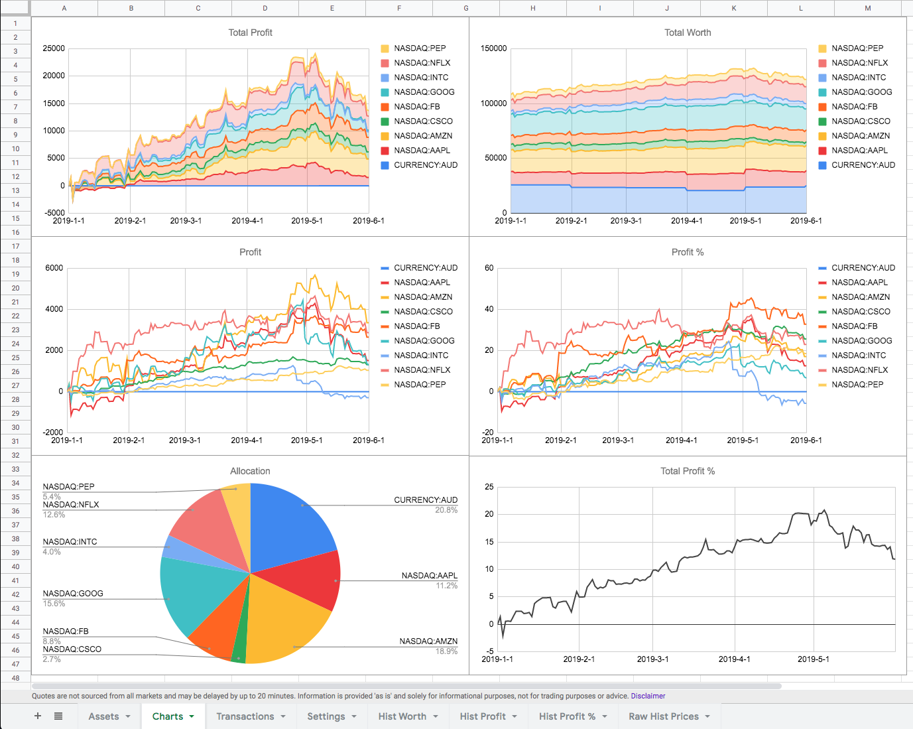
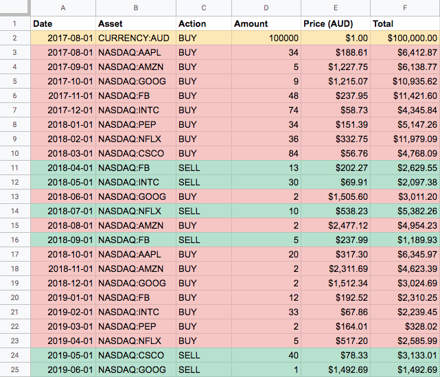

# Google Sheets Portfolio Tracker


<hr>


<hr>

### Main features

- Build a portfolio based on a list of buy/sell transactions.
- Track historical worth, profit, and profit percentage, both per asset and overall.
- Account for different currency rates, and show all prices in a single currency.
- Set the timeframe for calculation.

### Quick setup

1. Create a new Google Spreadsheet.
2. Add a sheet named `Settings`, based on [samples/settings.csv](samples/settings.csv).
3. Add a sheet named `Transactions`, based on [samples/transactions.csv](samples/transactions.csv).
4. Go to `Tools > Script editor`.
5. Add the contents of [dist/bundle.gs](dist/bundle.gs).
6. Refresh the sheet, and click `Portfolio > Load data` from the new toolbar menu.
7. Add as many charts as you like :chart_with_upwards_trend: :bar_chart: :rocket:

### Developer setup

After cloning the repo run `npm install`.

- Build the bundle: `npm run build`
- Build continuously: `npm run watch`

For a better development experience use [clasp](https://github.com/google/clasp) with
`dist` as the `rootDir`. Once configured, you can run the app as follows:

```
npm run build
clasp push
clasp run loadData
```
